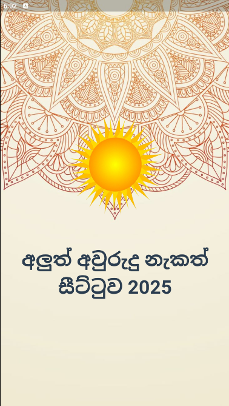
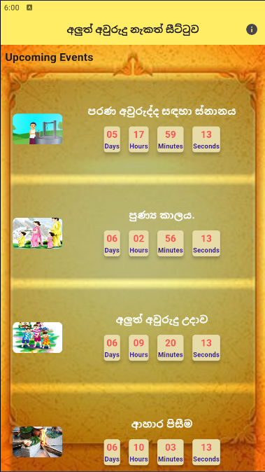
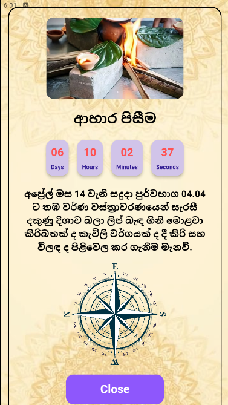
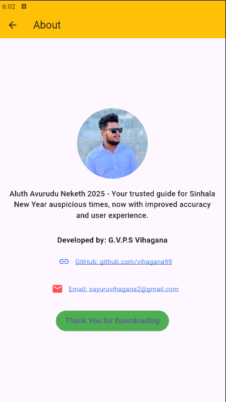

# New_Year_Nekeath_App_2025 Mobile App 🎉

Welcome to the New Year Nekath Reminder App for 2025! This app is designed to help users stay updated on auspicious times (nekath) and special events for the Sri Lankan New Year, with a smooth and modern user interface built with Flutter.

---

✨ **Features**
- 🗓️ **Nekath Notifications:** Receive timely notifications for all important New Year nekath times.
- 📅 **Nekath Countdown:** Countdown to each auspicious time to ensure you never miss a special moment.
- 🔮 **2025 Update:** New features and improvements designed to enhance the user experience.
- 🎉 **User-Friendly Interface:** A fresh and responsive design with smooth animations, built with Flutter for an enjoyable experience.

---

📱 **Screenshots**

---

📂 **Project Details**
- **Technologies Used:**
  - **Framework:** Flutter (Dart)
  - **UI Design:** Material UI
  - **Notification Service
  
---
  
🚀 **Try It Now**
You can download the app here:
- [New Year Mobile App - APK Download]([link_to_ap](https://drive.google.com/file/d/1qnpam2-DI3DC_JjE6PoU9lLjel6GaNuH/view?usp=drive_link))

---

👨‍💻 **Author**
- **Vihagana99**  
  [GitHub Profile]([link_to_github](https://github.com/vihagana99))

---
